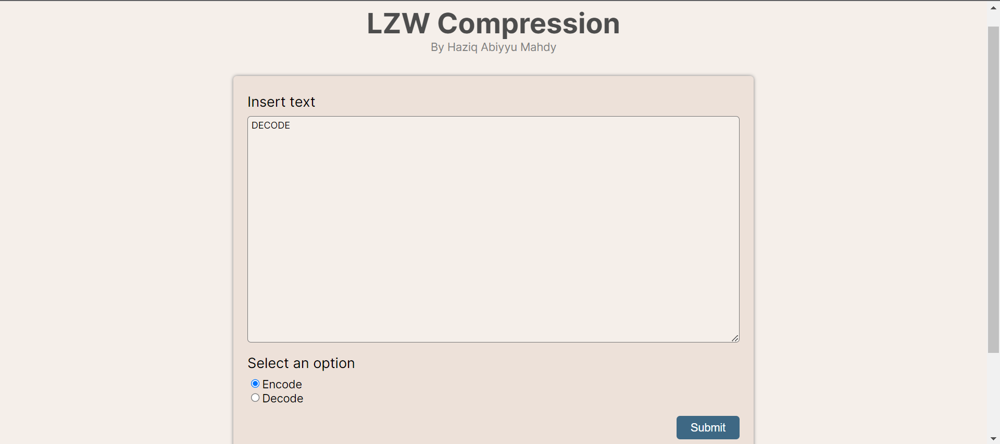
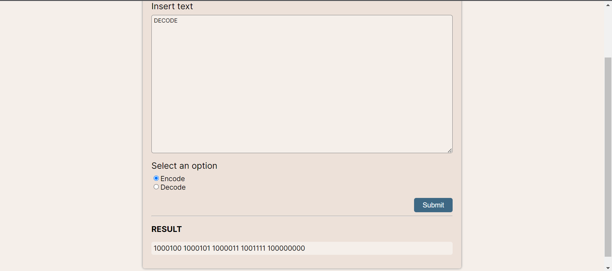

# Web based LZW encoder/decoder





## Description
Lempel–Ziv–Welch (LZW) is a universal lossless data compression algorithm created by Abraham Lempel, Jacob Ziv, and Terry Welch. It was published by Welch in 1984 as an improved implementation of the LZ78 algorithm published by Lempel and Ziv in 1978. LZW algorithm uses dictionary data structure to store sequence of characters that occurred in the text. For more information, <a href="https://en.wikipedia.org/wiki/Lempel%E2%80%93Ziv%E2%80%93Welch">click here</a>

## How to Run locally
1. Clone this repository
```
git clone https://github.com/haziqam/LZW-compression-algorithm
```
2. Navigate to `/server` directory
```
cd server
```
3. Install backend dependencies
```
npm install
```
4. Start server
```
npm run dev
```
5. Navigate to `/client` directory
```
cd ../client
```
6. Install frontend dependencies
```
npm install
```
7. Start app
```
npm start
```
8. The web app should open automatically. Otherwise, run `http://localhost:3000/` on your browser. 

## How to use
1. Insert text you want to encode/decode using LZW algorithm
2. Select an option (encode/decode)
3. Press `Submit` button
4. The encoded/decoded text will appear under `RESULT` label


## Author
- [Haziq Abiyyu Mahdy - 13521170](https://github.com/haziqam) 

## Built With
* React.js
* Express.js